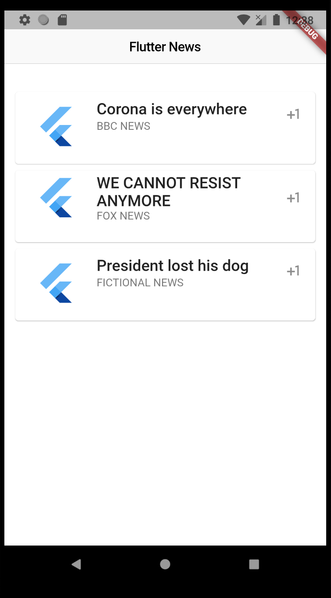

# Flutter-News
Simple Flutter integration with Spring Boot via REST API.

<p align="center">


</p>


## Installation

Clone the repo

```bash
git clone https://github.com/JayDew/Flutter-News.git
```

### Run the backend locally

You can either open it in your favourite IDE or run

```
./gradlew bootRun

```


__You will need to deploy the application__

Deploy the application any cloud-service provider. 
Replace the URL at lib/ service / httpService.dart with __your own URL__

For the time being, you can still use my deployed application, but I can not guarantee that it will be available by the time you alien from the future will try my application :) 


### Run the frontend 

```
flutter run
```


## Contributing
Pull requests are welcome. For major changes, please open an issue first to discuss what you would like to change.

Please make sure to update tests as appropriate.

## License
[MIT](https://choosealicense.com/licenses/mit/)
